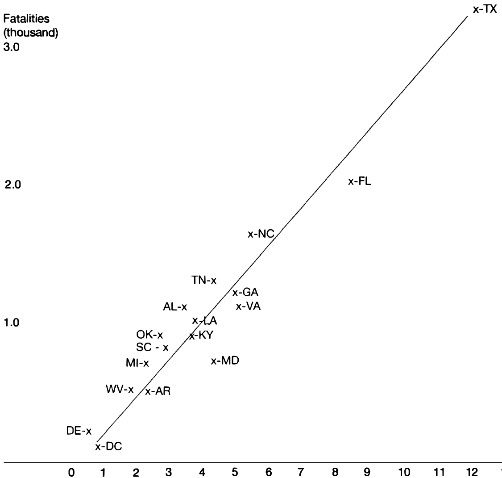
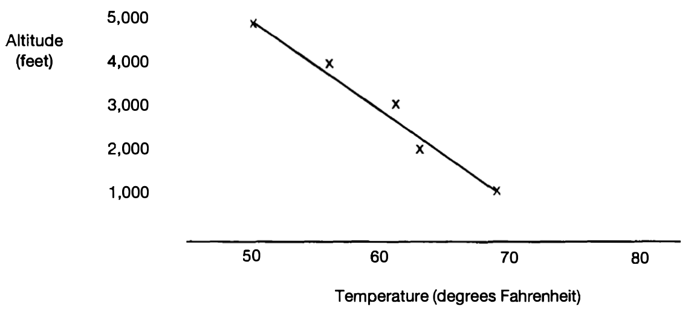
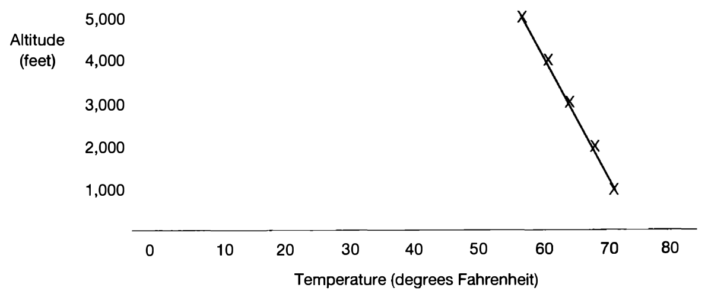
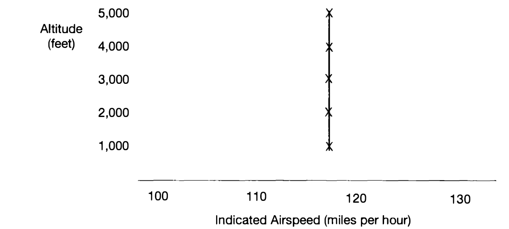
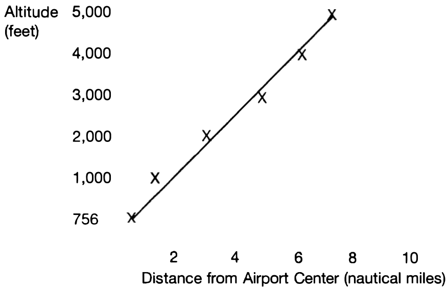
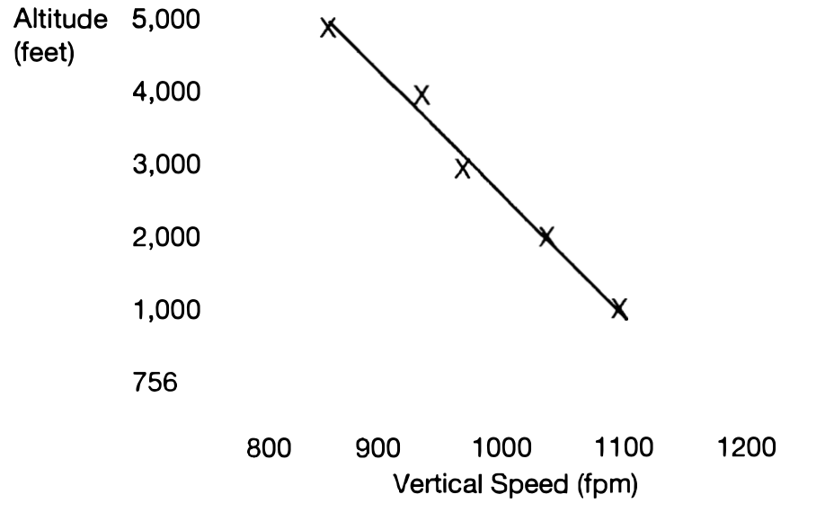

# CHAPTER 10 Generalization: Meaning, Sampling, Typicality, Tables, Graphs, and Correlations

Do you believe the following generalizations?

1. A person in trouble is more likely to get help from a group of witnesses to the person's problems than from a single individual.
2. Mental patients are usually not dangerous to other people.
3. The most successful women in what is still pretty much a man's world are most often those with older brothers.
4. Public opinion polls are often accurate within one or two percentage points.
5. Friendships are more likely to be formed between opposites than people who are similar to each other.
6. You are apt to forget more in the first few minutes after learning something than in the next several hours.

According to Gregory R. Kimble, author of *How to Use (and Misuse) Statistics,*[^1] who was at the time the chair of the psychology department of Duke University, the odd-numbered generalizations are false and the even-numbered ones are true. On the basis of an application of the criteria for credibility, I am inclined to believe him, although there are a few problems with interpreting and applying this set of generalizations.

The ideas in this chapter should be of use not only in reading and evaluating others' ideas, but in your own writing. You will encounter ways of expressing various types of generalizations, ways of presenting them visually, and ways of justifying them.

## Types of Generalizations

First, let us be clear about what generalizations are. A *generalization* is a statement about a number of cases. Generalizations can be categorized according to whether they go beyond the data on which they are based and according to their degree of universality. Some best-explanation hypotheses are generalizations, but not all. Furthermore, not all generalizations are best-explanation hypotheses.[^2] For example, the statement "A rising barometer is usually accompanied by improvements in the weather" is an example of a generalization that is not a best-explanation hypothesis. It does not account for the weather improvement last week (although it justified a prediction of probable improvement). Satisfying the criteria for best-explanation hypotheses (when they are relevant) can provide good support for generalizations, but in this chapter, I shall focus on other kinds of support.

[^1]: (Englewood Cliffs, NJ: Prentice Hall, 1978).

### Limited-to-the-Data and Inferred Generalizations

#### Limited-to-the-Data Generalizations

These cover only the cases that have been examined. Suppose that we examine the eye color of everyone in the room, counting the number of blue-eyed people and the total number of people, and find eight blue-eyed people out of twenty-two. The resulting generalization "Eight out of the twenty-two people here have blue eyes" is a limited-to-the-data generalization. It does not go beyond the data provided by our counting.

These generalizations appear to be the easiest to establish because they do not go beyond the data, generally requiring only counting. However, some difficulty often springs from the meaning of the terms involved, from bias by the investigator, or from the difficulty of securing access to countable things. For example, the generalization "All countries have social class structures (as opposed to being classless societies)" could be a limited-to-the-data generalization, but it might well suffer from all three of those problems. Deciding how to tell whether a country has a social class structure could be quite difficult. The investigator might well be biased, and access to information in many countries is difficult.

For an illustration of these difficulties in a different field, suppose we examine fifty mental patients and judge that only four are dangerous to other people. We might then state the generalization "Four of these fifty mental patients are dangerous to other people." This generalization does not go beyond our counting data, but there are still two standard problems. One problem is in determining what actually counts as evidence—in this case, of dangerousness in a patient. A second standard problem is in avoiding bias of the investigator—in this case, bias in determining whether a particular patient is dangerous. The problem of access might also be quite difficult, but in this case, I assumed that problem had been handled.

These three kinds of problems hold for inferred generalizations also, and must always be kept in mind. They come under at least the *C* and *S* in *FRISCO*, and inevitably the *I* as well.

#### Inferred Generalizations

For the rest of the chapter, I shall focus on *inferred generalizations*. They go beyond the data on which they are based by claiming that the characteristic holds for a larger group. As I interpret Kimble's generalizations, they are all inferred generalizations. For example, his generalization about mental patients applies to mental patients in general, not just to those studied.

[^2]: See Robert H. Ennis, "Enumerative Induction and Best Explanation," *The Journal of Philosophy*, 65 (18), 1968, pp. 523-530.

Some inferred generalizations are about a population, each member of which could be identified and studied if we had time and resources, such as a generalization about all practicing physicians in Urbana, Illinois, based on a sample of those physicians. Other inferred generalizations are about limitless populations, not all of whose members could be identified and studied, such as all mental patients, some of whom are dead, some of whom are not yet patients of any kind, and some not yet even born. We cannot secure the much-desired random sample of them. (There is more about random samples in the next section.) Generalizations that apply to limitless populations are theoretically the most difficult to evaluate because the nature of the population in the studied cases might be significantly different from the population in the cases we cannot study, rendering the generalization inapplicable. All of Kimble's generalizations apply to limitless populations.

### Degree of Universality

*Universal generalizations* hold that every member of the class being considered has the stated characteristic. They have the form "All A's are B's." Here are three examples:

1. All of the people in this room are adults.
2. Every action has an equal and opposite reaction.
3. Societies always develop class systems, even when organized with the goal of being classless.

The first of these universal generalizations is also a limited-to-the-data generalization because I looked at everyone in the universe that was mentioned (people in the room) and found only adults. The other two are universal inferred generalizations (and come under the *I* in FRISCO). Not all of the cases to which these last two generalizations apply have been examined.

*Less-than-universal inferred generalizations* claim that the characteristic holds for some (loosely or precisely specified) subclass of the members of the class. All six examples from Kimble's list are less-than-universal inferred generalizations, as is the following probability generalization: "The probability of getting a four on one roll of a die is 1 in 6." According to this probability generalization, one-sixth of the rolls, in the long run, should be fours. This is less than universal because it says neither that every roll will be a four nor that none will be a four.

#### Gambler's Fallacy

One danger in applying a probability statement is to fall into the trap of the gambler's fallacy. Suppose that the last ten rolls of the die have not been fours. Does that increase the chances of getting a four this next roll? To think so, assuming that the die is an honest one, is to commit the *gambler's fallacy*. If the six faces of a die have equal chances of coming up on top, then the past history does not affect the next roll at all. The chances of getting a four on the next roll are still 1 in 6, even though the last ten rolls have not been fours. But remember that I said, "assuming that the die is an honest one." If a long run record shows something significantly different from one out of six, then there is reason to suspect the die.

#### Streak Theory

Suppose that the last two rolls have been fours. Does that increase the chances of getting a four on the next roll? Suppose you have been having a run of especially good hands at cards. Does that mean that the next hand is more likely to be better than average? According to the *streak theory*, the answers are both *yes*. The streak theory holds that if you have been having a streak of one kind of thing, then the next shot is more likely to be that kind of thing. But if the die and the cards are honest, the streak theory is wrong also. The probabilities do not change with history.

Getting three fours in a row does not prove wrong the statement that the probability of getting a four is 1 in 6. (It is just that such a result is unlikely, if the probability statement is correct.) Similarly, finding one mental patient who is dangerous to others—or finding several—does not prove wrong the generalization about mental patients.

#### A Trade-off: Ease of Support Versus Utility in Application

In general, a few counterexamples do not prove a less-than-universal generalization wrong because the generalization does not claim to tell us what to expect or believe for every case. It tells us roughly what to expect in the long run for some amount of the cases. But there is a trade-off. The more a generalization is insulated from counterexamples, the less guidance it provides about what to believe or do. Even those that loosely specify a proportion or probability give us more guidance than those that use words such as *sometimes* and *often*.

Examples of less-than-universal generalizations that specify a proportion very loosely are Kimble's examples numbered 1 (*more likely*), 2 (*usually*), 3 (*most often*), 5 (*more likely*), and 6 (*more . . . than*). In these cases, the loose proportion is over one half. In contrast, a precise proportion (1 in 6) is specified in the probability generalization about the die.

But some less-than-universal generalizations indicate only a rough absolute number of cases (rather than a proportion or a probability). For example, generalizations containing the word *often* often (!) do not give us even a rough proportion. Consider this one: "Loud music often emanates from automobiles at this corner." This generalization tells us that loud music occurs at this corner with a frequency that is significant, but it could be only 10 percent of the time. All that is required to satisfy the requirements imposed by the word *often* is that it happen a good number of times, but not a high percentage of times. The word *often* is less helpful in giving us guidance than one that uses the word *usually*, which would require at least over 50 percent in the long run.

The meaning of *often* is heavily dependent on the situation and people's desires and expectations. In the case of an annoyance such as (for me) loud music emanating from cars, one in ten would be considered often. But one would not say "The salespeople at this store are often helpful" if they are helpful only 20 percent of the time. On the other hand, you might say "I often find $20 bills on my porch" even if it happens only once every two or three months.

This does not imply that nonproportional less-than-universal inferred generalizations are useless. Sometimes they are very useful. The fire chief who was mentioned in the previous chapter knew that arson can be a cause of fires. He knew—that is, a nonproportional less-than-universal generalization. If he had eliminated all the other possibilities, as he thought, then he had good reason to believe that it was arson that caused the fire. This shows that such *can-cause* knowledge can be quite useful. *Can-cause* generalizations are less than universal.

Here is another useful one: "Standing up in a canoe often causes it to tip over." This nonproportional, less-than-universal generalization is important for people who are learning to operate canoes. It specifies a danger that under most conditions should be avoided, even though we do not have a proportional statement to offer.

Consider the problem of the meaning of the terms in this generalization: "Three out of five doctors recommend Zenith Aspirin." What does that mean? Is it about a certain set of five doctors (method of selection unspecified), three of whom recommended Zenith Aspirin? If that is all that it means, then such a limited-to-the-data generalization is very easy to prove (and is uninformative, again illustrating the trade-off principle). To prove it, all we need to do is find three doctors who recommend Zenith Aspirin and two who do not. Then in the sense specified, three out of five doctors recommend Zenith Aspirin. But this could be quite misleading. One danger is that there could be a shift in the meaning of the words used in the generalization, so that the buying public would think that the generalization is about a portion of a much larger population of doctors. Then it would appear to give information that is significant, although it could well be absolutely false.

All these facts about the meaning of the words in a generalization serve as a warning to be very attentive to clarity in considering and applying generalizations (the *C* in *FRISCO*). Generalizations often appear to say more than they do. The less they say, the easier it is to justify them, but often, consequently, the less useful they are (a generalization!).

### Inference to Generalizations

If the words "Three out of five doctors recommend Zenith Aspirin" are used to express an inferred generalization, then presumably the data consist of a set of doctors, three fifths of whom recommend Zenith Aspirin. The generalization makes a statement about more doctors than those in the data. But who are these other doctors?

First, we need to distinguish among three groups: the group actually studied, a larger group (from which the sample, the group actually studied, has been drawn), and an even larger group, which includes the previous two groups and in which we are most likely to have the greatest interest. But ordinarily, the third group is too large to allow us to draw a random sample from it. So we want to extend our conclusions about the second group to the third group. The extension assumes that the smaller group is typical of the larger group. We cannot automatically go from a conclusion about the smaller group to a conclusion about the larger group, even if we could legitimately infer to the smaller group from the studied group.

Accordingly, there are two inferences, one from the studied group to the group from which the studied sample was drawn, and one from this group to the even larger group. People often forget about the fact that they are making this second inference, thinking that it is automatic, but it is not. The sampled group might not be representative of the larger group, even if the sample (the studied group) is representative of the sampled group.

For example, suppose that the doctors in a random sample of the doctors in Urbana, Illinois, are asked whether they recommend Zenith Aspirin, and that three fifths of this random sample reply affirmatively. Leaving aside for the moment some concerns about the meaning of the question, we might then justifiably conclude that three out of five doctors in Urbana recommend Zenith Aspirin. The doctors covered by this conclusion are all the doctors in Urbana, although only a random sample of these doctors were questioned. This first inference is legitimate if good jobs of random sampling and follow-up were done. But then someone might also conclude, "Three out of five doctors recommend Zenith Aspirin." This seems to be about a different and much larger population of doctors, possibly English-speaking North American doctors, perhaps even a larger group (all North American doctors? all doctors in the world?). The justification for extending the generalization would depend on the Urbana doctors' being typical of English-speaking North American doctors, or the even-larger group. I doubt this typicality, so would discourage this inference.

But if I had not been so specific about the identities of the sampled group and the larger group, the inference might pass unnoticed. Suppose that I said that three out of five doctors recommend Zenith Aspirin, and added in a footnote that this conclusion is based on a scientifically determined sample of doctors. That way of putting it neglects the distinction between the group sampled and the group that the ultimate generalization appeared to be about and, consequently, neglects the inference step from one to the other. I have often seen this distinction and the associated inference swept under the rug, not only in advertising, where we might expect it to happen, but in many other areas as well.

For example, in child psychology, we often find people talking about all children, basing their statements on a very restricted sample. They use terms such as *the child* or *children* that suggest that their statements apply to all (or almost all) children, when the evidence is about a sample of a limited population that is in many ways not typical of all children. An example is this statement by Jean Piaget, an influential Swiss psychologist: "We . . . describe the development of propositional logic, which *the child* at the concrete level (Stage II: from 7–8 to 11–12 years) cannot yet handle"[^3] (emphasis added). The problem of the meaning of some of the terms in this statement (*propositional logic*, 11–12, and *handle*) is severe as well.[^4] But the point here is to note the contrast between the universality of the statement and the size and nature of the group actually sampled: middle-class Swiss children. Please be warned that there is much more to this issue than is possible to indicate here, including the problem of inferring from the children actually studied even to middle-class Swiss children.

This problem of breadth of coverage is a general problem in the meaning of generalizations that we develop ourselves, as well as those asserted by others. We must try to be aware of the extent to which the generalization makes a statement about things or people that were not investigated or studied. That is, we must be alert to the meaning of the general terms in a generalization. To what do they refer? An all-too-frequent occurrence is a statement maker's acting as if the investigation justified reference to a larger group, when in fact the typicality of the smaller group is dubious. We shall return to the problems of sampling and typicality.

[^3]: Barbel Inhelder and Jean Piaget, *The Growth of Logical Reasoning from Childhood to Adolescence* (New York: Basic Books, 1958), p. 1.
[^4]: See my "Children's Ability to Handle Piaget's Propositional Logic: A Conceptual Critique," in Sohan and Celia Modgil (Eds.), *Jean Piaget: Consensus and Controversy* (London: Holt, Rinehart and Winston, 1982), pp 101–130.

Another question of meaning in this case, postponed earlier, is the meaning of the phrase *recommend Zenith Aspirin*. What sort of evidence does it take to establish that a doctor recommends Zenith? Does it mean that the doctor recommends only Zenith Aspirin, or that the doctor recommends Zenith as well as other kinds of aspirin and some other pain relievers as well? Because it is in the interest of advertisers (and others) to get us to buy the products advertised (and to do other things), we must be due cautious about the meaning of the words used by them.

### Summary

Generalizations are either limited-to-the-data or inferred, and either universal or less-than-universal. Less-than-universal generalizations are either proportional or loosely numerical (using terms such as *often*, *sometimes*, and *at least some*). Proportional generalizations are vague (using terms such as *usually* and *generally*) or precise (stating probabilities or percentages). In general, the more informative a generalization, the more difficult it is to defend; and the less informative, the less susceptible to defeat by counterexamples (the *trade-off principle*).

Inferred generalizations are sometimes the result of an inference from a sample to a population from which the sample was drawn, and are defended on the basis of the method of sampling (a topic to be discussed soon). Sometimes the generalization goes beyond the population from which the sample was drawn and is about an even larger population. The justification of the larger-population generalization depends on the extent to which the sampled populations is typical of the larger population. The leap from the sampled population to the broader population often slips by unnoticed, a danger.

The degree of satisfaction of the four best-explanation criteria is relevant to those generalizations that are best-explanation hypotheses. But in this chapter, we are focusing on support by representativeness.

Probabilities for honest items (such as dies and cards) do not change with history. To think that a run of one sort reduces the chances of getting another of that sort is to accept the gambler's fallacy. To think that the chances are thereby increased is to accept the streak theory. Both are errors.

## Check-Up 10A

**True or False?**

If false, change it to make it true. Try to do so in a way that shows that you understand.

10:1 Universal generalizations hold that every member of the class or group being considered has the characteristic in question.

10:2 A characteristic of proportional generalizations is that they go beyond the data on which they are based.

10:3 Although generalizations are usually relatively simple in structure, their meaning must frequently be carefully considered.

10:4 The generalization in 10:3 ("Generalizations are usually relatively simple in structure") is a less-than-universal generalization and is informative as it stands.

10:5 The following is a probability generalization: "The chances of getting heads in the toss of a coin are one half."

10:6 According to the generalization in 10:5, one half of the tosses of the coin, in the long run, will turn out heads.

10:7 If the generalization in 10:5 is true and the last three tosses turned up tails, then the chances are better than even that the next one will turn up heads.

10:8 If the generalization in 10:5 is true and if the last three tosses turned up tails, then the chances are better than even that the next will turn up tails.

10:9 It is legitimate to extend a generalization to a population larger than the population from which a random sample was drawn, as long as we are assured that the sample was indeed random.

### Longer Answer

10:10 Consider the generalization "Societies always develop class systems, even when organized with the goal of being classless." Assume that a class system is a system within a given society consisting of a prestige and power hierarchy (resulting in some identifiable classes' being of higher status and power) and in which somehow there is considerable passage of the class status of parents to their offspring.

a. Cite examples and, if you can, counterexamples to this generalization.

b. Revise the generalization if you feel that it needs revision in order to be true.

c. Write a short defense of the generalization, as revised (if you revised it). Heed FRISCO.

10:11 Find a generalization in a newspaper, magazine, research report, etc. Copy it and give the source.  

a. Tell what type of generalization it is (limited-to-the-data or inferential, universal or less-than-universal).  

b. Comment on its meaning. Is it misleading? State its meaning in other words than those in which it is written.  

c. Tell whether you think that the evidence supports the generalization. Explain why you think as you do. (Do not expect to do a perfect job here. Just do the best you can. But do not neglect such considerations as credibility of sources, and actual reports of the data on which the generalization is based.)

## Sampling and Typicality

In 1936, the magazine *Literary Digest* surveyed public opinion in an attempt to predict who would win the United States presidential election: the republican, Alfred Landon, or the democrat, Franklin Roosevelt. Ten million ballots were sent out to find out how that sample of the voting population felt about the candidates. Over two million of these ballots were returned. On the basis of these returns, the *Literary Digest* concluded that more voters would vote for Landon than for Roosevelt (an inferred less-than-universal generalization). As it turned out, however, Franklin Roosevelt won 60 percent of the votes and was reelected. This error in prediction is a classic one in the history of sampling.

At least part of the problem was that the people chosen to receive the mailing were selected from telephone books, lists of subscribers to the magazine, and lists of owners of automobiles, resulting in a systematic bias in favor of the well-to-do, who were more likely to vote republican. The sample selected for study was not representative of the voters of the United States.

Furthermore, the fact that the prediction was based on a return of only slightly more than a fifth of the people solicited leaves room for more bias. Were voters for Landon or voters for Roosevelt more likely to return the ballots? What do you think? Opinion surveys that depend on the people surveyed to return their answers generally obtain a return of much less than half, always raising a question of bias. People who return survey forms are different from those who do not. The difference might make a difference in the outcome. This is not to say that one should automatically disregard results of surveys that depend on the people surveyed to return an answer. Rather, this is an important factor to consider. We should always try to ascertain the percent return in a survey and consider what difference there might be between those who returned an answer and those who did not.

Ways that survey makers can reduce the problem include providing a stamped self-addressed envelope, making it very easy to respond to the survey by asking few questions (or only one), following up on a survey request with a barrage of further requests to comply, perhaps appealing to the conscience of those being surveyed, and actually interviewing each person personally. There are problems with each of these approaches, as you can imagine, and no solution is perfect.

### Random Sampling

How can a sample be selected that is representative of the population from which it is selected? Securing a random sample of sufficient size is the standard ideal answer. To say that a sample is *random* is to say that each member of the population had an equal chance of being selected. Securing a random sample requires that we have access to the entire population, so that each member has an equal chance of being included.

Suppose that we want to determine whether student opinion supports the thesis of a president of a university stated in a speech published in the student newspaper. The thesis is, "Tuition and fees at this university are reasonable." Assume that there are 10,000 students. Suppose that it is too much trouble or too expensive to query all 10,000 students in a way that will produce sincere answers, so we decide to select a random sample of about 1,000 students, ordinarily a sufficient number for a random sample. In order to give each an equal chance of being selected, we need to have a list of the entire student body. We could put all the names in a large drum, mix them well, and draw out 1,000 names, making sure that there were no mechanical problems, such as two names sticking together, or a name being caught in a crevice. To avoid such problems, we could write the names on 10,000 ping pong balls and mix them in a large sphere. It is not easy mechanically to give every name an equal chance of being selected, even if we have a complete list, but having the list is a necessary condition.

A simpler way than using names written on ping pong balls or slips of paper would be to use a table of random numbers from a book of statisticians' tables. Such tables consist of long lists of randomly selected digits, from 0 to 9. Here is a part of a table I have on my bookshelf: "23157548590183725993762497088695." It goes on, and on, and on. We could go through the list of students and assign each student in order a digit from the table. For example, starting from the beginning of the series just presented, the first student gets a 2, the second a 3, the third a 1, the fourth a 5, etc. Then we could arbitrarily choose one digit by closing our eyes and touching down in the middle of a table with a pointer. Suppose the pointer points to a 5. Then we could include in our sample every student who had been assigned that particular digit. That is, we pick all students who had been assigned 5. That procedure would give us about 1,000 students selected at random from the 10,000.

Another way to use the table would be to number the students from one to 10,000 and, starting at some arbitrary point in a table of random numbers, select a series of 1,000 four-digit numbers, neglecting any duplicates. The students who have those numbers would be in the sample. Starting at the third digit of the sequence in the last paragraph, students with the following numbers would be included in the sample: 1,575, 4,859, 183 (neglecting a beginning zero), 7,259, 9,376, 2,497, 886, etc. (Even if there were only 8,000 students in the population, we could proceed this way, just ignoring all numbers over 8,000.) Can you suggest a number to assign to the 10,000th student, given the four-digit procedure?

Random sampling does not guarantee representativeness, especially with a small selection. I took a random sample of eight people from a population of forty-eight people in a group composed of thirty-six males and twelve females. Of the eight people in the sample, three were females and five were males. In the sample, then, three-eighths were females, although in the population only one-fourth, or two-eighths, were females. A sample of eight people is a very small random sample if representativeness is important to us. On the other hand, a random sample of several thousand members is very likely to be representative. Of course, several thousand was impossible in my sample from forty-eight people, but with such a small population, sampling is often unnecessary anyway. Sampling is most useful when the population is so large that examination of every member is too difficult or expensive.

Even after selecting a random sample from 10,000 students, there would still be problems in determining the opinions of these selected students: Some might be out of town or ill, some might be reluctant to answer, and the questions we ask might be misleading to some. But the point here is that a random sample can be drawn from a population to which we have access. Giving each member of the population an equal chance of being selected is feasible.

The absolute size of the sample, rather than the percentage of the population selected, is of primary importance in sampling. If the *Literary Digest* had actually secured a random sample of only 1,000 of the voters in the entire United States and had determined how each one of these people was going to vote (not missing one), then it would very likely have come within a few percentage points of the actual vote. These facts (the importance of the absolute size rather than the relative size and the adequacy of a random sampling of 1,000 for most purposes) are facts about random sampling that surprise many people.

Because it is often extremely difficult to secure a random sample of even 1,000 and to examine *every* member, there would still have been good reason for concern. Securing a random sample was practically impossible for the *Literary Digest* because of the problems of developing accurate lists and of securing valid information from every person selected for examination. The expense and difficulty of identifying and securing valid information from pure random samples bring people to seek substitute methods.

### Systematic Sampling

An alternative that makes the process of selecting the sample slightly easier is systematic sampling. Instead of using a random selection process, a systematic process is used, such as selecting every tenth student on our list of 10,000 students, starting with an arbitrarily picked one of the first ten. The mechanics of this procedure are easier, leaving the selection process less susceptible to error (an advantage), but there is the possibility of systematic variation in the way that students are listed, a variation that might make the sample unrepresentative. I do not see much chance of this sort of thing in the ways that I imagine students would be listed, so I would settle for a systematic sample in this case. But a systematic sampling procedure would not have helped the people from the *Literary Digest*. They still would have needed complete lists and would have needed to secure returns from those sampled in a way that did not bias the results. Furthermore, systematic sampling would not have increased the efficiency of sampling. They would have had to do just about as much work one way or the other.

### Stratified Random Sampling

Because of the difficulties involved in securing valid results from each member of a selected sample, stratified random sampling is sometimes used. *Stratified random sampling* consists of breaking up the population into groups, and then randomly sampling each group. It enables us to reduce—to some extent—the size of the group selected without losing accuracy, if we stratify on variables that are correlated with the characteristic we are estimating. Consider again the survey of student opinion about the president's thesis about tuition and fees.

We might expect the freshmen to view the thesis somewhat differently from the seniors, and perhaps the juniors and sophomores will differ from each other as well as from the others. We want to be sure that each group is fairly represented in the final sample. Males and females might differ from each other also, as might people from different departments and ethnic backgrounds. In order to explain this idea, I shall neglect departments and ethnic backgrounds, but they should certainly be considered in a sampling of this sort. The goal is to use the groupings that make the most difference. For present purposes, I shall assume that gender and class level make the most difference.

Suppose that there are 2,500 in each class and that half of each class is female and half male. Then there would be eight groups of 1,250 members each. See Table 10.1. We would then take a random sample from each group, ensuring equal numbers of females and males, and equal numbers from each class in the total sample.

If there is a high relationship between class or gender and opinion about the president's thesis, we can manage with fewer people sampled without losing validity of results. In this case, we might be able to reduce our sample size by 30 percent, maintaining the same degree of accuracy. Stratified sampling down to about 88 people per group (about 700 in all) to study carefully would actually be an improvement over studying 125 per group (1,000 in all) less carefully. Their remarks could then be given more consideration, missing returns could be pursued more effectively, and interviews would be more feasible. Viewed differently, the cost of the interviewing without increasing the care of the work would be less with stratified sampling, not a full 30 percent less, but significantly less, if the interviewing is expensive. In any case, however, we would need a complete list of all the members of the population to make sure that everyone in each subgroup of 1,250 had an equal chance of being chosen.

### Cluster Sampling

In its simplest form, *cluster sampling* calls for selecting a sample of groups (or clusters) from the total population being studied, and then sampling within the groups that are selected, but only from those groups. In effect, the *Literary Digest* people did cluster sampling, but they apparently did not sufficiently consider whether the groups they selected were representative of the total population. In fact, it is clear that these groups were not representative because they included only people with a telephone, or an automobile, or a subscription to *Literary Digest*.

One advantage of cluster sampling is that we are not required to list the entire population being sampled. In its simplest form, we are required to list the populations of the clusters that have been selected, so that we can do a pure random sample (or stratified random sample) within those groups.

**TABLE 10.1  Eight Cells from which to Draw a Stratified Random Sample**

|Class|Women|Men|
| ---------| -----| ---|
|Freshman|x|x|
|Sophomore|x|x|
|Junior|x|x|
|Senior|x|x|

*Note: An "x" indicates a cell from which to take a random sample in order to secure a stratified random sample, stratified according to gender and class. Each "x" represents 1,250 people.*

The trick is to secure a set of clusters that represent the total population. The election pollster's dream is a small town that is representative of the entire state, province, or country of which it is a part. Then a single cluster (the town) would be enough, and all we would have to do is to study it intensively. This intensive study might itself consist of selecting a set of representative subclusters, perhaps city blocks, and doing intensive study within the selected blocks. Ultimately, a random sample, or complete enumeration, would be made, but only then would it be necessary to do the onerous task of completely listing and locating people, even the reluctant ones. Unfortunately, the pollster's dream town cannot be identified with complete assurance until after the fact, but pollsters do have techniques that they feel give them reasonable assurance that they can identify representative clusters throughout a voting area, clusters that can then be studied intensively.

A cluster sampling of the 10,000 students might mark out a set of dwelling areas or units, list these units, and randomly select one third of the units (or clusters), which would each then be studied by random sampling within the clusters. In order to attain the same accuracy of sampling, one would ultimately need to draw a sample of more than 1,000 students, but the larger number would be more geographically concentrated and thus easier to locate. Furthermore, one would not need to obtain lists of the members of the units not sampled. For roughly the same precision of estimation, then, one might actually have less trouble, depending on how much more trouble it is to track down people as geographically separate as those in a pure random sample. Incidentally, if the sampled units are not roughly equal in size, then the results for the units must somehow be weighted in accord with the size of the unit.

A simpler but less accurate alternative: If there is some class hour when almost all students are in class, then a randomly selected sample of classes (clusters) can be drawn from classes meeting at that hour, and each selected class examined, either by random selection within the selected classes or by securing the opinions of all the students in the selected classes. It might actually be easier to secure the opinions of all the students within a class, given that the class and the teacher have to be interrupted anyway, if only a simple question is asked. If all the students within selected classes are to be queried, one might pick at random about one-sixth of the classes (or clusters) for study for roughly comparable accuracy, though more than 1,000 students would be examined. With a planned random sampling of one-third of the students in the selected classes, we might select one-third of the classes at random for comparable accuracy.

The numbers required here are vague—with only rough approximations—because of a variety of technical factors in determining the accuracy of estimation. Consult a text on sampling for more details. But from this account, you should now have a fairly good idea of the broad outlines of the process and the type of problems involved.

### A Danger in Sampling, and the Case-Study Alternative

Although random sampling and its variations seem to some people to be the only scientific way to estimate a characteristic without examining the whole population, there are those who disagree. The basis for the disagreement lies in the fact that examination of a large number of people often results in a superficial examination of each. Even though random sampling can reduce the number needed to somewhere between 100 and 2,000, depending on the accuracy desired, that still requires a large number of people, if the characteristic being estimated is not easily identified or measured. Eye color is easily enough determined for large numbers of people. Prospective voting intentions are less easily determined because people might be reluctant to tell the truth to someone they do not know. They might fear ridicule or rejection. Furthermore, they might not have thought about the matter enough at the time of the query, and make a snap judgment that would later be reversed.

Characteristics such as fluency, numeracy, critical thinking ability, and self-confidence are much more difficult to determine. Even one person's opinion about the president's thesis in her speech is not easy to determine because such opinions are likely to be very complicated and to consist of varying shades of agreement and disagreement. The simplicity of the questions required for surveys of characteristics can result in distortion of the characteristics.

An alternative that is often suggested is the case-study approach, or some variation thereof. A case study calls for intensive, extended, and thoughtful observation and interpretation of one, or a few, cases. In-depth interviewing of a few of the 10,000 students, selected to make sure that they are different from each other, would be an example. Each student interviewed would be asked for reasons, descriptions of the background situation, opinions of other students, descriptions of discussions with other students, etc. The primary rule for the investigators is to keep their eyes and ears open in sensitive, careful, and creative ways. This approach enables the investigators to secure a much better picture of the entire situation and to better analyze what students really think about a president's thesis, so its proponents argue.

Difficulties with case studies, according to their critics, are that generalization from case studies is not easy (or not possible), and that the reporter often puts his or her own subjective interpretation on the situation. The relative value of case studies is a controversial issue.

### Inferring to a Broader Population

It is tempting to draw a conclusion about a broader population based on a sampling from a population that is contained within that broader population. For example, we might be tempted to draw a conclusion about all university students in the country, based on a random sample of the opinions of the students in one particular university. You saw earlier the danger in inferring to all doctors from a random sample of a population of Urbana doctors, even though the random sample is a representative sample of Urbana doctors. And you saw the result of inferring to the United States population of voters in 1936 from a sample drawn from people with a telephone, automobile, or subscription to the *Literary Digest*. But such inferences are not always wrong. It depends on whether the sampled population is typical of the broader population.

In agricultural research, where the techniques of sampling are used extensively, inferences to broader populations are regularly made. For example, a study based on a sample of a type of wheat this year is generalized to apply to the same type of wheat next year. We could not have sampled next year's wheat because it did not exist when the sampling was done. But on the assumption that this year's wheat of the given type is typical of wheat of that type (an assumption that is defended by examination of its characteristics), we are ready to extend the generalization beyond the population from which a random sample was drawn.

Unfortunately, the rules for judging typicality do not have the clarity and precision of the rules for random sampling. You must keep your eyes and ears open and be well-informed. Because of what we know about wealth and voting habits, we know that the *Literary Digest* people had no right to generalize from the populations from which they sampled to the population of the United States. On the other hand, because of the regularity of characteristics of species of plants, we feel comfortable inferring to a generalization that is about more than the wheat from which we drew a random sample.

But there is more to keeping your eyes and ears open and being well-informed. The best-explanation reasoning pattern can be applied here. If we make a number of studies of wheat, voting preference, or opinions about the college president's thesis, even though these are not of randomly selected clusters of the population and they respectively turn out about the same, then we might justifiably infer that the trait pervades the population if there is no other plausible explanation of the agreement among the results and if we responsibly have searched for one. Thus, a judgment of typicality can be buttressed by the best-explanation approach to reasoning.

### Summary

One standard way to justify an inference from a group to a broader population containing the group is to have the group be a random sample of the population. A *random sample* is a sample drawn in such a manner that each member of the population has an equal chance of being selected for the group. For the estimate to be accurate, the sample must be of fairly good size, somewhere between 100 and 2,000 depending on the confidence one seeks to have in the accuracy of the estimate. In securing this confidence, the size of the sample is much more important than the size of the population. A random sample of 1,000 from a population of 10,000 justifies not much more confidence in accuracy than a random sample of 1,000 from a population of 200 million, even though the proportions selected are very different (1 in 10 versus 1 in 200,000).

Problems with studies using random sampling can include having a low percentage return from the sample that is selected (leaving it open that the returns do not represent the population), inability to make the complete list required for randomly selecting the sample, difficulty in locating and securing returns from the ones selected, misinterpretation of questions and refusal to answer them truthfully, and the oversimplification that is sometimes required in order to secure countable answers.

Alternatives to pure random sampling include systematic sampling, stratified random sampling, cluster sampling with random sampling within the clusters, and variations and combinations of these. All require a sample of good size. The stratified random sample can be somewhat smaller than a pure random sample for the same degree of confidence in accuracy if the variables of stratification are well-correlated with the characteristic being investigated. The cluster sample approach generally requires a larger-sized sample than the pure random approach, but does not require listing of all members of the broader population, and often facilitates access to the sample because the members are usually grouped together geographically.

There is much more to say about sampling than has been said here, much of it being fairly technical. For more details, I recommend a standard text on sampling.

Because of the problems with random sampling and its allies, some people recommend as an alternative the use of intensive case-study techniques, which they feel give more of the full flavor of a situation. On the other hand, random sampling and allied methods, their proponents often maintain, are the only scientific way to study a population without studying every member.

In any case, inferences that go beyond a population sampled or studied depend on the typicality of that population. Being well-informed, keeping one's eyes and ears open, being sensitive, and using best-explanation reasoning techniques are the keys to determining typicality.

## Check-Up 10B

**True or False?**

If false, change it to make it true. Try to do so in a way that shows that you understand.

10:12 A sample in which the person selecting the sample did not deliberately bias the selection is a random sample.

10:13 A pure random sample is necessarily representative.

10:14 A pure random sample with a size of 2,000 drawn from a population of 100 million would for most purposes provide an estimate in which we could have sufficient confidence.

10:15 A sample produced by drawing a random sample of groups and then drawing a random sample of individuals within the selected groups is called a systematic sample.

10:16 A case-study approach is thought by its supporters to be superior to a random-sampling approach in part because it does not force an over-simplification on complex and deep social phenomena.

10:17 One difficulty with a pure random sample of a size greater than 1,000 is that it is likely to be unrepresentative of the population.

10:18 There is no basis for inferring to a larger population than the population from which a random sample has been drawn, even though the larger population includes the population that has been sampled.

10:19 A stratified random sample can justify a smaller sample, if the variables of stratification are related to the variable being studied.

### Medium Answer

10:20 A tennis ball machine produces 2,000 tennis balls per hour. In order to check on the quality of the production, the inspectors systematically select 500 tennis balls (every fourth one) from the first hour of an eight-hour production run and the same number from the last hour of the production run, securing 1,000 tennis balls altogether. Each of the 1,000 balls is given the bounce and squeeze tests, and is visually inspected for apparent defects. The thinking is that if the production is all right at the beginning and end of a run, it is no doubt all right in the middle.

a. What do you think of these inspection procedures, and why?

b. What would you do, and why?

10:21 The school board of a large city containing 100 elementary schools wants to secure an estimate of the number of third-grade students who understand and are able to use contraposition and avoid conversion in everyday situations. An interview-type test has been devised that takes about thirty minutes of a student's time, but the number of students is too large for the test to be given to every student. Assume that there are four classes of about 25 third-graders in each of the 100 schools, making 10,000 third-graders altogether. Tell how you would draw a sample of about 1,000 third-graders for testing, and explain why you make the choices you do. Because you do not know all the details about this school system, you will need to make some assumptions about the situation.

10:22 Find a report of a sample-based survey that tells the size of the population sampled, the size of the sample, the method of sampling, and the conclusion that was drawn. Apply the FRISCO approach to this report and include a copy of the report with your comments.

10:23 Design a sampling study that is intended to answer a significant question. (1) State the question, (2) describe the population of interest (including approximate size), and (3) describe the population from which the sample will be drawn if it is different from the population of interest. If it is different, also (4) explain how you will justify inferring to the population of interest, (5) describe your sampling plan (including numbers), and (6) describe the technique for securing information about the selected individual (for example, if you will ask one or more questions, state them and give your plan for interpreting them). Prepare to describe your planned study to your class or group.

## Interpretation of Data: Tables, Graphs, and Correlations

Tables, graphs, and correlations are useful ways of presenting data and of developing and testing hypotheses about relationships. Because most of you have learned about tables and graphs elsewhere, I shall here only do a quick review of some important features. Although this section is primarily for those who feel somewhat uncomfortable with tables, graphs, negative and positive relationships, and correlation relationships, others will find some interesting questions here. First, let us examine a table of numbers related to highway fatalities (Table 10.2).

**TABLE 10.2 Traffic Fatalities, Population, and Registered Vehicles for Sixteen Southern States and Washington, D.C., 1976**

|1.State|2.Highway Fatalities (thousands)|3.Population (millions)|4.Registered Vehicles (millions)|5.Highway Fatalities per 100,000 Population (Column 2 x 100 /Column 3)|
| ----------------| ------------------------------| ---------------------| ------------------------------| --------------------------------------------------------------------|
|Texas|3.24|12.60|8.97|26|
|Florida|2.02|8.35|5.85|24|
|North Carolina|1.58|5.46|3.89|29|
|Georgia|1.30|4.98|3.33|26|
|Tennessee|1.28|4.23|2.81|30|
|Alabama|1.14|3.65|2.58|31|
|Virginia|1.06|5.05|3.30|21|
|Louisiana|1.00|3.88|2.34|26|
|Kentucky|.90|3.44|2.35|26|
|Oklahoma|.86|2.77|2.21|31|
|South Carolina|.83|2.84|1.77|29|
|Mississippi|.72|2.37|1.45|30|
|Maryland|.68|4.13|2.51|16|
|Arkansas|.53|2.12|1.35|25|
|West Virginia|.52|1.83|1.04|28|
|Delaware|.14|.58|.36|24|
|Washington, D.C.|.08|.70|.37|11|
|Average|1.05|4.06|2.73|25.5|

What is the meaning of the number 3.24 at the top of Column 2? A glance at the column heading tells us that 3.24 is in the column containing numbers of highway fatalities in thousands. It is in a row labeled *Texas*. Therefore, the number 3.24 is the number of highway fatalities (in thousands) in Texas, or roughly 3,240. The title of the table tells us roughly what we can expect to find in the table. Actually, three very important places to look in a table of numbers are the title of the table, the column headings, and the row labels. Sometimes, in order to avoid clutter in a table, footnotes are added to explain some special fact. These must be examined also.

The number 3.24 was stated in terms of thousands and rounded off for convenience. The exact figures would have made it more difficult to see the relationships in the table as a whole, and probably are not absolutely accurate anyway.

Comparing the number 3.24 with the numbers by the names of the other states gives us some idea of how serious 3.24 is. But we must be careful. Of course, a rate of 3,240 highway fatalities is serious no matter what the number is in other places. But relative to the other places, did Texas have the most dangerous highways that year? A quick and careless look at Columns 1 and 2 might suggest that, of the places listed, Texas has the most dangerous highways because 3.24 is the highest number in Column 2. But note that Texas had more people and more vehicles than any of the other places, so it does not seem fair to judge it the most dangerous without taking into account the size of the population exposed to traffic fatalities. West Virginia has .52 in Column 2. Does that mean that West Virginia had safer highways? No, because it had a much smaller population than Texas (1.83 million, as can be seen across from West Virginia in Column 3). There were many fewer people available to be hurt on the highways.

Looked at another way, the number of fatalities in Texas was about three times the average for all of these states (given at the bottom of Column 2), but that does not show that Texas was three times as dangerous as the average. It has about three times the average population of all these states (see the bottom and top of Column 3).

One way to make a comparison is to make a ratio of the number of fatalities to the number of people, and compare these ratios. Roughly speaking, such a ratio shows the chances, if you were a member of that population, that you had of being a fatality, neglecting other factors than just living there. I have calculated the ratios (Column 5) and find that the highway fatalities per hundred thousand people were 26 for Texas and 28 for West Virginia. (Because I worked with rounded numbers, these figures are not precise. They are close enough for us to say that the rates were about the same.)

The important point here is that comparisons can be misleading. When reading or making tables of figures, we should seek fair comparisons. Often, some note of warning should be included, unless one's audience is sophisticated enough that the warning is not needed. Of course, the date of the information should be noted. Things might well be different now, and the year studied might have been an exceptional year. Is there reason to think that conditions in 1976 were significantly different from now?

It is easy to be misled by tables. One must stop and think about the numbers. Numbers do frighten some people, but simple numbers like these need not be frightening. Just stop and think about their meaning (the C of FRISCO). A higher number of fatalities does not by itself mean that a place is more dangerous.

### Graphs

Graphs that show relationships can be intimidating. But all it takes is reading the titles and thinking about the meaning of the points and lines. Look at Graph 10:1, which shows a point for each place plotted on two axes: one for fatalities and one for population. The line at the bottom on the horizontal direction is called the horizontal axis, and here it shows population. The line in the vertical direction is called the vertical axis; here it shows traffic fatalities. In looking at a graph, one first thing to do is to become familiar with what each axis represents, and of course, to read the title.

Each place has been represented by a point (shown by an x), determined by going straight up from its population number and going straight across from its fatality number. Anywhere on a horizontal line across the graph indicates the number of fatalities shown by the number it crosses at the left. Anywhere along a vertical line drawn up from the bottom indicates a population of a size given by the number it crosses at the bottom. To get a point for Texas, we go across from 3.24 for fatalities, and go up from 12.60 for population. That point represents fatalities of 3,240 and population of 12.60 million, as one can tell by going back to the axes: going straight down from the point we cross the horizontal axis at 12.60, and going across from the point we cross the vertical axis at 3.24.

The display of points in a graph like that of Graph 10.1 is called a scatterplot. (I plotted the points and they are scattered about.) I also drew a line (called the line of best fit) that represents a hypothesis about the relationship in that set of places between population and fatalities in the year studied. Because the line does not go directly through all the points, there must be other things than size of population that influenced the number of fatalities.

#### Graph 10:1 Traffic Fatalities vs Population in Sixteen Southern States and Washington, D.C.

Until I drew the line, I was engaged in limited-to-the-data generalizing. But the line suggests that there is a relationship that holds for population sizes not represented in the data. For example, it could be the basis of a prediction that if Texas had a population of only 11.0 million, there would have been somewhere around 2.8 thousand (or 2,800) fatalities. (Draw a straight line up from 11.0 million until it touches the line of best fit that I drew. Then, from the point of touching draw a line straight over to the vertical axis at the left and see where it hits—about 2.8.) The line of best fit represents an inferred generalization that goes beyond the data.

The limited-to-the-data generalization is this: For these seventeen places, larger populations tended to have more highway fatalities in the year studied. An inferred generalization is this: Places with larger populations are likely to have larger numbers of highway fatalities. This inferred generalization seems plausible, but I do not intend to defend it further.

Here is another limited-to-the-data generalization: In the areas studied, there tended to be fewer fatalities per person in and around the capital of the United States than in places away from the capital. Here is another inferred generalization: The people who live in and around Washington, D.C., tend to be more cautious on the highways. What do you think of these generalizations? They illustrate the distinction between observation and inference that I drew back in Chapter 4, if you are willing to think of the limited-to-the-data generalization as a set of observations. If not, then at least the distinctions are parallel and the warning the same: We generally must be more wary of inferences that go beyond the data than of the data on which they are based.

### Positive and Negative Relationships

In the highway fatality case, the line of best fit shows a positive relationship between population and fatalities. That is, it suggests that as the population gets larger, the number of fatalities increases as well. A line that slopes up as it goes to the right shows a positive relationship. As one variable gets larger, so does the other. In contrast, a negative relationship is one in which, as one variable gets larger, the other gets smaller. See Table 10.3 for an example.

To secure the information in Table 10.3, a copilot recorded information from a set of aircraft instruments as the pilot took off and climbed to 5,000 feet en route to the destination. The primary purpose was to see the relationships between altitude and temperature, but a number of other items were recorded as well. In order to secure accuracy of estimates, the same operation should be repeated a number of times (three is often a good number of times) and the results averaged to get a good estimate, because precise reading of these instruments is not possible, and because mistakes can creep in. But my purpose here is to illustrate relationships, using tables and graphs, so for the sake of simplicity, let us neglect the securing of multiple readings. These few pieces of data do not by themselves establish relationships, but they are striking enough to give one good reason to believe that there are some significant relationships here. (Other data and theoretical considerations do, however, support trends evident here.)

**TABLE 10.3 Altitude, Temperature, Airspeed, Vertical Speed, and Distance from Airport on a Routine Takeoff and Climb**

|Altitude (feet)|Temperature (Fahrenheit)|Airspeed (miles per hour)|Vertical Speed (feet per minute)|Distance from Airport Center (nautical miles)|
| ---------------| ------------------------| -------------------------| --------------------------------| ---------------------------------------------|
|756[^5]|72|no reading|0|0.5[^6]|
|1,000|70|115[^7]|1,100|1.1|
|2,000|67|115|1,050|2.8|
|3,000|63|115|980|4.4|
|4,000|60|115|920|5.9|
|5,000|56|115|850|7.5|

[^5]: The top row gives the data just before takeoff. The airport is 756 feet above sea level.

[^6]: The pilot was attempting to maintain a constant indicated airspeed.

[^7]: This information can be directly read from an instrument called a DME (Distance Measuring Equipment).

#### Graph 10:2. Altitude vs. Temperature on a Selected Flight

What do the data tell us about the relationship between altitude and temperature? We can see that the temperature went down as the altitude increased. (A general rule at these low altitudes, by the way, is that the temperature usually decreases about 3°F for each thousand feet of altitude—a well-established generalization.) This relationship is plotted in Graph 10:2.

Note that the line goes up to the left, not to the right. This means that the relationship is a *negative* relationship. As the altitude increased, the temperature decreased.

Note also that the variable on the horizontal axis does not start at 0. Can you see that if it had ranged from 0 to 80, the line would have been much steeper in slope? See Graph 10:3, based on the same data, and compare it to Graph 10:2. The lesson here is that relationships and differences can be made to appear in different ways by excluding or including selected portions. There are other ways of being fooled by the way the scale is set up. One in particular is the use of logarithmic scales. If you remember logarithms, you might imagine how this can occur.

Next, look at a scatterplot with a line of best fit for altitude and indicated airspeed for this flight in Graph 10:4. The line of best fit (a perfect fit this time) goes straight up and down. No matter what the altitude (in this sequence of observations) the indicated airspeed was the same. So there was no apparent relation in this sequence, something that we can see from the line's being straight up and down. However, we do not learn anything from this about the possibility of a real relationship between attitude and indicated airspeed because the pilot deliberately kept the indicated airspeed at 115 mph as the airplane climbed. At constant power and vertical speed, the indicated airspeed would in fact have declined as this aircraft climbed.

What would you infer from a line of best fit that goes straight across, not slanted at all? Similarly, it would indicate no apparent relationship in the data because it would tell us that there was no change in the variable on the vertical axis when there were changes in the variable in the horizontal axis. If you do not see that, then study the graph a bit until it becomes clear.

Draw or imagine a scatterplot using altitude and distance from the airport. You should get a line that slopes upward to the right, showing a positive relationship for this particular segment of this particular flight. Does that show that climbing causes an airplane to be farther from the airport? Not in ground distance. The airplane could just as easily have circled and arrived at 5,000 feet when it was just over the place where it started. The ground distance from reference point on the airport could then have been the same as at departure. Climbing does not cause airplanes to be farther away across the ground from a position. Although there was a relationship in this flight, it was what some people call a *spurious* relationship. I think that the word *spurious* is a bit strong because it implies that the relationship is counterfeit or false. I suggest instead calling it a noncausal association because, in that situation, there really was a relationship. What do you think?

### Correlations

*Correlation coefficients* are a numerical way of expressing the degree of relationship between two variables. They range from +1 to -1, with 0 indicating no relationship at all. +1 indicates a perfect positive relationship; -1 indicates a perfect negative relationship. If a relationship is *perfect*, then there is a formula for precisely calculating either one, given the other. A high negative relationship is stronger than a low positive relationship. For example, a relationship of -.9 is stronger than a +.3.

For some examples of correlation coefficients, consider some data and graphs presented earlier in this chapter. The correlation coefficient for the relationship between traffic fatalities and population in Graph 10:1 is .98; the correlation coefficient for the relationship between altitude and temperature presented in Graph 10:2 is stronger than -.99; and 0 is the correlation coefficient for the relationship between altitude and indicated airspeed (no relationship in this particular study) in Graph 10:4. The first two are very high correlations compared with those commonly obtained in the social sciences. For example, the correlations between college entrance tests and grades in college tend to run less than +.50 and are regarded as significant.

Making scatterplots like those in the graphs is helpful in visualizing the situation, but the correlation coefficient is an efficient means of reporting the relationship, and has other uses as well. See a statistics book for some of these uses.[^8]

As with other generalizations based on data, one must be careful in inferring beyond the data on which the correlation is based. For example, it would be a mistake to infer from the data given here that the correlation between altitude and indicated airspeed is generally zero. In fact, it is not. The greater the altitude, the less the indicated airspeed, other things remaining equal. What made the 0 relationship in this case was the pilot's deliberately maintaining an indicated airspeed of 115 mph by adjusting the controls. This warning is often ignored in the social sciences, which make heavy use of correlations. Instead, investigators and interpreters often blithely assume that their sample is representative of the general population or of the population to which they desire to apply the correlation. For example, people often assume that a high correlation between a multiple-choice test of English usage and good writing will hold of groups for whom the multiple-choice test has become a high-stakes test. (An example of a high-stakes test would be an admissions test or advanced placement test for which getting a good score is very important to some people.) People often train to take such tests, thus reducing the actual relationship between the test and good writing.

Although correlation coefficients can be very useful, be careful. Figures do not lie, but liars certainly do figure (and suggest misleading interpretations of the figures).

### Summary

Key features of tables and graphs are their titles and the labeling of their horizontal and vertical axes. Then one must also determine whether the numbers or lines mean what they might at first seem to mean. One way to do this is to see what bearing a conclusion drawn from data might have on you. For example, does the highway fatal-ity table tell you that you would be at greater risk in Texas than in other places considered?

[^8]: The type of correlation coefficient employed here is the most common kind, the Pearson Product-Moment Coefficient of Correlation. It is used for linear relationships, those that can be represented by a straight line.

A good way to see whether there is a relationship between two variables is to make a scatterplot. Each point marked with an *x* shows an individual person or thing. Its location is determined by its value on each of the axes. After all the points are marked, a line of best fit is drawn. It represents a beyond-the-data hypothesis about the relationship between the variables for the data that were used. Such lines of best fit do not tell us which of either variable is a cause of the other, nor that there is a causal relationship between the variables. They might be arbitrarily related, as is the relationship between altitude and distance from the airport. Neither was a cause of the other. And they might be really related, as are altitude and indicated airspeed for that type of aircraft; but the relationship might be masked, perhaps by the investigator's procedures, as in the case when the pilot deliberately maintained an indicated airspeed by adjusting the trim control.

A positive relationship is one in which, as one variable grows larger, the other does also. Positive relationships appear as sloped lines going up to the right (and down to the left) in standard ways of using axes. Negative relationships are those in which as one variable grows larger, the other grows smaller. Negative relationships appear as lines that slope up to the left (and down to the right). Lack of relationship is shown by lines that are either horizontal or vertical, or by no drawable line of best fit.

Correlation coefficients (which range from +1 to -1) are often used to show the strength and nature of relationships. A strong positive relationship is shown by a high positive decimal number that is close to, but not larger than, +1. A strong negative relationship is shown by a high negative decimal number that is close to, but not lower than, -1. A number hovering around zero indicates no relationship.

## Check-Up 10C

**True or False?**

If false, change it to make it true. Try to do so in a way that shows that you understand.

10:24 A negative relationship, using standard ways of labeling axes, slopes up to the left.

10:25 If the points on a scatterplot all appear on the same line and the line slopes one way or the other, there is an apparent relationship between the variables for the data used.

10:26 The entire possible range of a variable should appear on its axis.

10:27 A correlation of +1 indicates a strong negative relationship.

10:28 A correlation of +.8 indicates a stronger relationship than a correlation of +.4.

10:29 A correlation of +.4 indicates a stronger relationship than a correlation of -.8.

### Medium Answer

10:30 Make a scatterplot for altitude and distance from the airport for the data in Table 10.3. Draw a line of best fit.

10:31 Make a scatterplot and line of best fit for altitude and vertical speed when the airplane is flying.

a. Why did you select the range you did for the variable altitude?

b. Is the indicated relationship positive, negative, or neither?

c. Do you think that the relationship is causal? Explain. If you cannot answer this or explain why (because you are not familiar with the facts), then just read the suggested answer.

10:32 Make a scatterplot and line of best fit for highway fatalities and registered vehicles from the data in Table 10.2.

a. Is there an apparent relationship between these two variables? If so, is it positive or negative?

b. Do you think that there is a real causal relationship between these two variables? Defend your answer.

10:33 Make a scatterplot and line of best fit for temperature and distance from the airport, based on the data in Table 10.3.

a. Is there an apparent relationship between these two variables? If so, is it positive or negative?

b. Do you think that there is a real causal relationship between these two variables? Defend your answer.

c. Can the data be generalized to a general relationship between distance from the airport and temperature (for example, "The farther one gets from this airport, the colder it is")? Why?

### Longer Answer

10:34 Do a study in which you gather data that can be put in a table and a graph. Make the table and a scatterplot and line-of-best fit graph. Give the titles to the table and graph, and label the rows, columns, and axes.

a. On your scatterplot, did you start both variables at zero? If so, why? If not, why not?

b. Is there a positive or negative relationship, or neither?

c. Is there a causal relationship between the variables? If so, in which way? Explain.

## Suggested Answers for Chapter 10

### Check-Up 10A

10:1 T
10:2 F
10:3 T
10:4 T
10:5 T
10:6 T
10:7 F
10:8 F
10:9 F

10:2 Add *sometimes*.

10:7 Change *better than even that the next will turn up heads* to *still one half that the next will turn up heads*.

10:8 Change *better than even that the next will turn up tails* to *still one half that the next will turn up tails*.

10:9 It is legitimate to extend a generalization to a population larger than the population from which a random sample was drawn as long as the population from which the sample was drawn was typical of the larger one.

10:10 and 10:11 These are up to you.

### Check-Up 10B

10:12 F
10:13 F
10:14 T
10:15 F
10:16 T
10:17 F
10:18 F
10:19 T

10:12 A random sample is one in which every element in the population sampled had an equal chance of being selected.

10:13 A pure random sample of sufficient size is probably representative.

10:15 Change *systematic sample* to *cluster sample*. (Instead of this, you could give a definition of systematic sampling.)

10:17 A pure random sample of a size greater than 1,000 is likely to be representative of the population.

10:18 There is a basis for inferring to a larger population than the population from which the random sample was drawn, when the smaller population is typical of the larger one.

10:20 
a. By neglecting the middle six hours, they risk missing problems that develop in those six hours but that are not causing trouble at the beginning and end.

b. It would probably be better to select every sixteenth ball (a systematic sample for the whole day). But perhaps the machine is systematically making every sixteenth ball badly and everyone is missed. It would probably be better to select at random six five-minute periods in each hour and to select at random one-eighth of the balls produced in each selected five-minute period. Again, 1,000 balls would be selected. I do not know enough about tennis ball production to be more specific.

10:21 Deliberately omitted.

10:22–10:23 These are up to you.

### Check-Up 10C

10:24 T
10:25 T
10:26 F
10:27 F
10:28 T
10:29 F

10:26 The entire possible range of variables is often not included on a graph so that a certain range can be examined more thoroughly.

10:27 Change *negative* to *positive*.

10:29 Change *stronger* to *weaker*.

10:30 Altitude vs Distance from Airport:

10:31 Altitude vs Vertical Speed:

a. This was the range in the table.  

b. Negative. (We cannot give a value for the altitude of 756 because we do not know what the vertical speed is at takeoff. The 0 vertical speed reading was obtained before the airplane was flying, as can be seen by the concurrent airspeed reading.)  

c. Yes, because the airplane's power and the density of the air on which the propeller can get a "bite" reduce with the altitude. (Giving a good answer to this question requires knowledge of the field. If you figured it out, good for you!)
